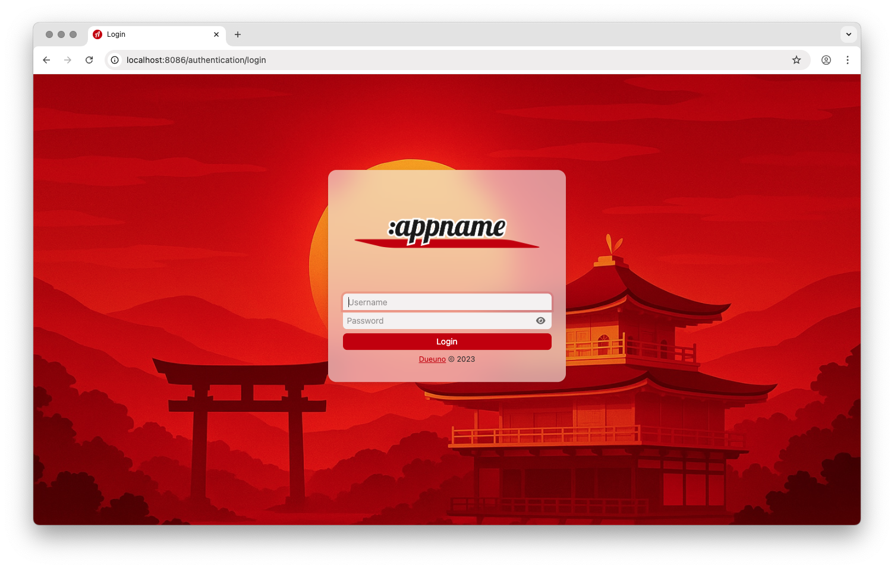

[](https://x.com/dueunoframework)

# Application Template

With [Dueuno Elements](https://dueuno.com) you can build Back-Office Web Applications with a single programming language: [Apache Groovy](https://groovy-lang.org).

## Getting Started
You need to install [Git](https://git-scm.com) and the [JDK 17](https://www.oracle.com/java/technologies/downloads/?er=221886#java17).

> With the upcoming release of Apache Grails 7 we will support the latest LTS Java releases.

```
$ git clone https://github.com/dueuno-projects/dueuno-app-template
$ cd dueuno-app-template
$ ./gradlew bootRun
```

> The first run will take some time since Gradle has to download all the needed dependencies.

You should see something like this:

```
>                                                                            <
>                         _                                                  <
>                        | |                                                 <
>                      __| |_   _  ___ _   _ _ __   ___                      <
>                     / _` | | | |/ _ \ | | | '_ \ / _ \                     <
>                    | (_| | |_| |  __/ |_| | | | | (_) |                    <
>                     \__,_|\__,_|\___|\__,_|_| |_|\___/                     <
>                               E L E M E N T S                              <
>                                                                            <

Grails application running at http://localhost:8080 in environment: development
```

Point your web browser to [https://localhost:8080](https://localhost:8080):



Login with `super/super` to manage the whole application or with `admin/admin` to manage the `DEFAULT` tenant.

## Start your project
To create a new application from the template:

1. Find/replace the string `dueunoapp` in all project files with a name of your choice
2. Rename the `dueunoapp` package with a name of your choice

## Create a `.jar` executable
1. Run `./gradlew bootJar`
2. The application `.jar` file will be generated under `/biuld/libs`
3. Run the application with `java -jar dueunoapp-1.0-SNAPSHOT.jar`

## Documentation
You can write the project documentation editing the files under `/src/docs`

1. Run `./gradlew asciidoctor`
2. The `html` documentation will be generated under the `/docs` directory

## Dueuno Elements
You can find the latest Dueuno Elements documentation here: https://dueuno.com/docs

## Community
Join us on Discord: https://discord.gg/6yWnmT2hBj

## License
Dueuno Elements is an Open Source software released under the [Apache License, Version 2.0](https://www.apache.org/licenses/LICENSE-2.0.html).

## Remember...
```
It's not what you do,
it's how you do it.

Happy coding :)
```