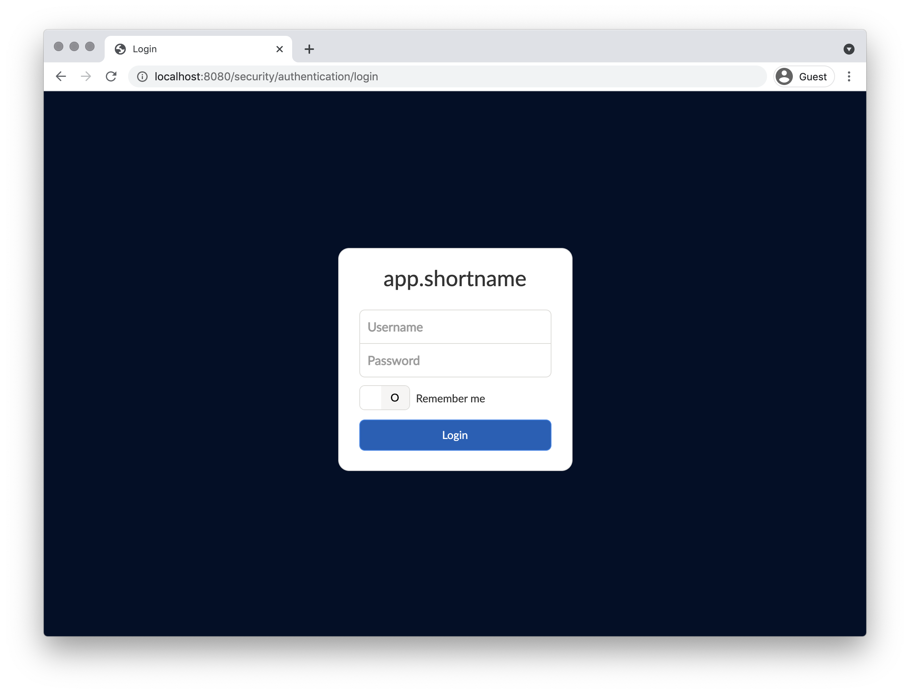

= Project Name
:source-highlighter: coderay
:compat-mode!:
:icons: font
:toc: left

// Please install the "AsciiDoc" IntelliJ plugin
// How to format text: https://asciidoctor.org/docs/asciidoc-syntax-quick-reference/

== Description
Description of the software

== Configuration
.application.yml
[source,yml]
----
include::code/application.yml[]
----
<1> Note #1
<2> Note #2
<3> Note #3

== Execution
To execute the application run the following command:

.Windows
[subs="attributes"]
----
cmd /C "set JAVA_OPTS="-Dspring.config.location=C:/path/to/config.yml" && C:/path/to/bin/{application-name}.bat"
----

.Unix
[subs="attributes"]
----
JAVA_OPTS="-Dspring.config.location=/path/to/config.yml" /path/to/bin/{application-name}
----

== User Guide
Describe how to use the software, maybe with screenshots:

